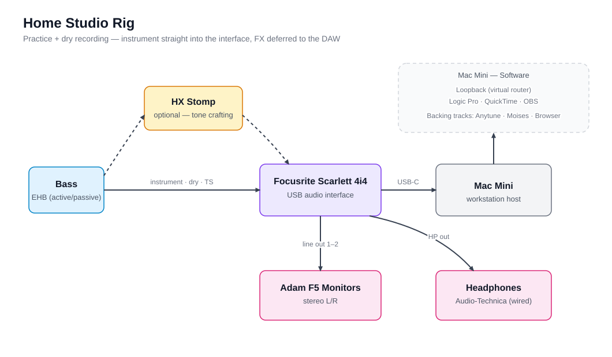
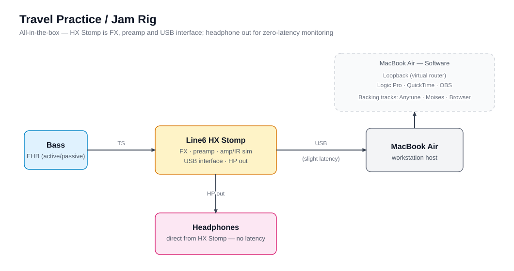
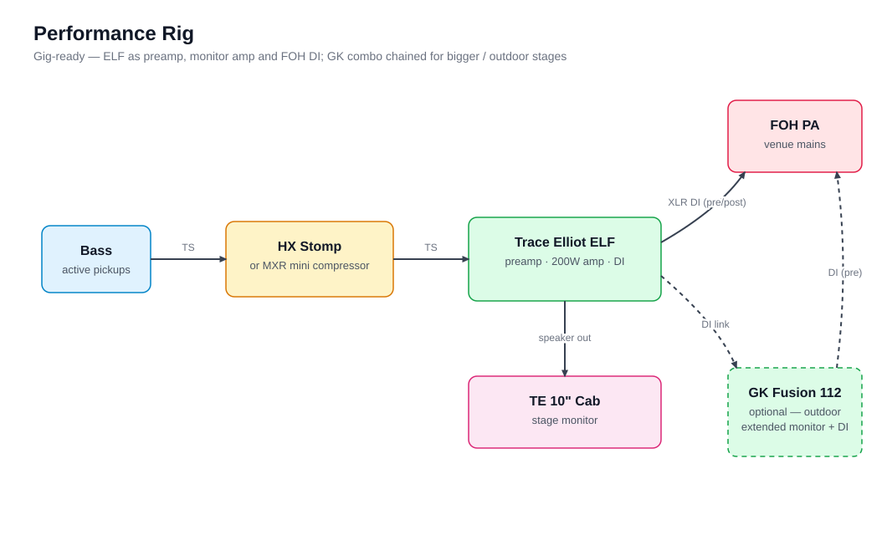

# Bass Rigs

This project documents the rigs I use on bass — for practice, performance, and
content creation. The concepts apply to other instruments (guitar, keys, etc.),
but the specifics here are bass-focused.

It starts with a **general framework** that describes the components a rig can
contain as concepts, then lays out the **three setups** I actually run —
[Home Studio](#home-studio-rig), [Travel Practice / Jam](#travel-practice--jam-rig),
and [Performance](#performance-rig) — each with a diagram and its benefits and
tradeoffs. A [Future Directions](#future-directions) section covers what may
change the setups going forward.

## Objectives

### Practice

A practice regimen requires:

- The ability to play and clearly hear what I'm playing
- Playing with or against some form of backing track (or metronome)

The ability to record is useful for:

- Sharing with others (e.g. an instructor)
- Self-review

### Performance

The point of performance is to play well and sound good for others — working
with venues' sound engineers and their platforms.

### Content Creation and Music Production

Content creation includes building instrument tracks as part of song
construction. Instrument and gear choices help craft the tone a song demands.

This leans on sound engineering and music production skills, built through
iterative experimentation with gear (on top of proficiency on the instrument).
Gear gets expensive though — GAS is real — so the setups below favor a small
number of flexible, reusable components over sprawl.

## Rig Framework

Before the specific setups, it's useful to describe what components can sit in a
rig and where each tends to sit in the signal chain:

1. **Instrument** — the bass.

2. **FX** — effects, which may include:
   - Dynamics (compression)
   - Distortion / overdrive
   - Modulation
   - EQ / filtering
   - Time / spatial (delay, reverb)
   - Pitch / harmony

3. **Preamp / Amp** — tone shaping and amplification, optionally with **IR / cab**
   simulation.

4. **DI** — feeds Front-of-House (FOH) PA.

5. **ADDAC** (A/D–D/A converter — device + software driver) — the audio interface:
   - Inputs from the signal chain (the instrument can bypass upstream gear and go
     direct here), typically 2–4 channels.
   - Outputs (2–4 channels) to studio monitors and/or headphones.
   - Exposes channels to the workstation for routing.

6. **Workstation** — the host computer and its audio routing:
   - **Virtual router** (Loopback on Mac) aggregates and routes sources:
     - Backing-track sources route to a stereo output pair.
     - Instrument inputs from the ADDAC route to separate output pairs.
     - A monitor mix sends the combined output back to the ADDAC for audio.
   - **Backing-track sources** feeding the router:
     - *Live* — browser streaming, gaming, or streaming software.
     - *Pre-recorded* — music/video players, DAW, browser/app-based.

   The goal is to keep routing simple so software processors (DAWs, streaming/
   recording) have a consistent set of inputs to work from.

7. **Signal processors** (running on the workstation):
   - **Recording software** — simple live capture (e.g. QuickTime) for quick shares.
   - **DAW** (Logic Pro on Mac) — edit, mix, master. Pre-recorded backing tracks
     import directly as audio; instrument and backing tracks can also be recorded
     live. **DAW plugins (VSTs) can supply FX, preamp, amp and IR** inside the box,
     which changes what physically needs to be in the signal chain.
   - **OBS** — video capture, streaming, recording. Sources include the display,
     web cams, and any of the router outputs / monitor mix / external mics. Scenes
     set up the video + audio layout.

> The lines between **FX (2)** and **Preamp/Amp (3)** blur, because some devices
> play both roles. The HX Stomp, for example, provides FX *and* amp/IR simulation
> in a single box.

The signal chain varies by setup — any of the components above may or may not be
present depending on context. The three setups I run are below.

## Setups

### Home Studio Rig

Optimized for practice and recording **dry** (no upstream FX). It can be used
purely for practice, or for bass-track recording where FX are added to the dry
track in the DAW.

- **Instrument** — typically an EHB-style bass with both active and passive
  pickup/EQ options.
- **FX** — usually none for practice (instrument goes direct to the ADDAC, dry).
  An HX Stomp is inserted when experimenting with or crafting tones — though FX
  can equally be handled in the DAW (see below).
- **ADDAC** — Focusrite Scarlett 4i4 (Gen 3), out to **Adam F5** studio monitors
  and Audio-Technica wired headphones.
- **Workstation** — a **Mac Mini** hosts the workstation, with **Loopback** as the
  virtual router.
- **Capture** — QuickTime (quick shares), Logic Pro (recording / backing tracks,
  with FX added downstream of the dry track via VSTs), and OBS (audio + video
  performance recording).

#### Benefits

- Clean, dry takes — maximum flexibility for mixing/mastering decisions later.
- Simplified signal path; fewer variables to manage during a take.
- Best monitoring of the three setups (studio monitors + quality headphones).
- Encourages separating the performance from the tone shaping.

#### Tradeoffs

- Fixed location — the least portable setup.
- Requires discipline around mixing/mastering to land a finished sound.
- Less immediate "feel" without an FX chain coloring the performance.

> **Deep dives:** [Setup guide](./rigs/home/studio-rig-setup-guide.md) ·
> [Bill of materials](./rigs/home/studio-rig-bom.md) ·
> [Loopback configuration & backup](./rigs/home/loopback-configuration-guide.md)
> (router layout shown in [loopback-configuration.png](./rigs/home/loopback-configuration.png)).

### Travel Practice / Jam Rig

A general-purpose, minimal setup that isn't optimized for any single objective —
it trades quality and screen space for portability.

- **Instrument** — typically an EHB-style bass with active/passive options.
- **FX + Preamp + ADDAC** — a **Line6 HX Stomp** does all three: FX, a rudimentary
  preamp/amp-IR, and the USB audio interface. Its **headphone out** provides a
  zero-latency monitoring path for practice/performance.
- **Workstation** — a **MacBook Air** hosts the workstation, with **Loopback** as
  the virtual router.
- **Capture** — QuickTime, Logic Pro, and OBS, same as the Home Studio.

#### Benefits

- Highly portable — collapses to a bass, one box, a laptop, and headphones.
- All-in-the-box FX/amp/IR; presets travel with you.
- Headphone-out path removes USB latency during practice.

#### Tradeoffs

- Audio quality compromise (headphones over monitors; small box over dedicated gear).
- Latency disparity between the direct headphone path and the USB/DAW path.
- Limited CPU can reduce audio streaming/sampling quality.
- Limited screen real estate.

### Performance Rig

Built to sound good for gigs and to stay flexible with venue sound systems and
constraints.

- **Instruments** — usually a couple of traditional-style basses with onboard
  active pickups for tonal/EQ options. This keeps tone control at the bass, though
  it's rarely needed.
- **FX** — a Line6 HX Stomp, or a simple compressor (MXR mini series).
- **Preamp / Amp / DI** — a **Trace Elliot ELF** serves as preamp, monitor amp, and
  FOH DI, paired with a **TE 10" cab**. For outdoor venues where the TE can be a
  little weak, a **GK Fusion 112** combo chains off the TE's DI out and acts as an
  extended monitor — the TE 10" + GK 12" together make a clear (if unorthodox)
  monitor combo. The GK preamp's DI can run in **pre** mode (bypassing the GK
  preamp) for a more transparent FOH sound if the engineer prefers.
- **Capture** — not currently used for live gigs, though a more formal venue/band
  capture for live recordings (with extended mixing and DAW input) may be designed
  in later.

#### Benefits

- Self-contained monitoring (ELF + cab) plus a clean FOH DI feed.
- Flexible with venues — DI to mains, drive a stage monitor, or both.
- Scales up: chain the GK combo for bigger/outdoor stages.

#### Tradeoffs

- Worst portability of the three; the ELF/GK DI chaining is a hack — hard to bring
  the full monitor setup when traveling to gigs/jams.
- The ELF/GK DI tone may not suit every venue PA.
- No live capture path today.

## Future Directions

A few directions under research could change the setups above:

1. Replace the Line6 HX Stomp with a **Neural DSP Quad Cortex** or **Darkglass
   Anagram**.
2. Transition the workstation from macOS to a **Linux** platform.
3. Switch the DAW from Logic Pro to **Reaper**.

Two primary reasons drive these:

- **Mac platform obsolescence for audio gear.** In late 2026, Apple drops Rosetta
  Intel emulation. It's questionable whether Apogee or Focusrite will ship Apple
  Silicon drivers, Logic Pro is Mac-only, and Reaper runs well on SteamOS/Linux —
  which opens interesting options for live recording.
- **Simplifying live rigs.** Modern software FX + preamp/amp/IR modelers fit in one
  device (the HX Stomp already does this), simplifying workflow and presets. A
  single device with integrated cab sim *and* ground lift would replace both the HX
  Stomp and the DI box — the current ELF/GK DI solution is a hack, especially when
  traveling without the monitor setup.
