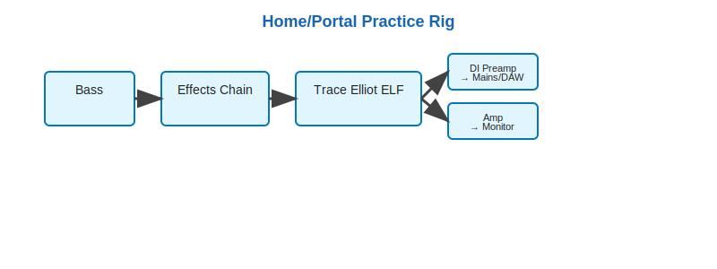

# Rigs

This project documents bass rigs I use for practice and live.

## General Signal Chain

The signal chain includes the following:

1.  Instrument (Bass)

2.  Effects chain

3.  Preamp/EQ

4.  Preamp out:

    a.  DI (mains are not part of my rigs, AWS is)

    b.  Amp for monitor

## Home/Portal Practice Rig

### Rig configuration

1.  Active Bass (onboard EQ)

2.  HX Stomp and/or Analog Pedalboard

3.  Trace Elliot ELF (onboard EQ and 200W Power amp)

4.  Trace Elliot ELF outputs:

    a.  DI preamp to mains / DAW

    b.  Amp to monitor speaker

### Benefits

-   Less components
-   Flexible, suitable for simulation - Amp/IR simulation via software if using the HX Stomp
-   Small setup, portable

### Tradeoffs

-   A bit more complicated (HX stomp and software / setup configuration)
-   Small wattage for practice amp, may not be suitable for jamming with multi-piece band.

## Group Practice/Simple Live Rig

### Rig configuration

1.  Active or Passive Bass (EQ Pretuned)

2.  HX Stomp and/or Analog Pedalboard

3.  GK Fusion 112 (onboard EQ, preamp, and power amp)

4.  GK Fusion 112 outputs:

    a.  DI preamp to mains

    b.  Internal routing preamp to 400W amp for internal speaker, 800W external

### Benefits

-   Simple
-   Good for practice/jamming with a band
-   Flexible venue support - Drive PA through DI/mains, or ability to drive external cabs

### Tradeoffs

-   GK DI/Amp may not be the right sound for some venues
-   Worse portability

## Generic DI Rig

### Rig configuration

1.  Active or Passive Bass (EQ Pretuned)

2.  HX Stomp and/or Analog Pedalboard

3.  DI Preamp (such as Tech 21 SansAmp or EBS Microbass, may provides Amp/IR simulation)

4.  DI Preamp outputs to PA mains:

    a.  DI preamp to mains (supplied by venue)

    b.  Preamp headphones out (for practice)

### Benefits

-   Highly portable - out of a single bag
-   Highly flexible, depending on DI/Preamp selected
-   Ideal for headphones/travel practice

### Tradeoffs

-   Completely reliant on venue for PA
-   Preamp Amp/IR configuration may not work well with venue PA system
