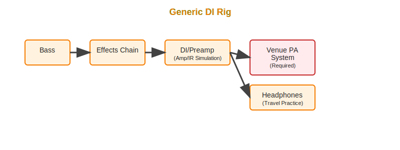

# Bass Rigs

This project documents bass rigs I use for practice and live.

## General Signal Chain

The signal chain includes the following:

1.  Instrument (Bass)

2.  Effects chain - Compression, chorus, reverb, pitch shifting, etc

3.  Preamp/EQ - Amp and Cab (Impulse Response, or IR for short) simulation

4.  Preamp out:

    a.  DI (mains are not part of my rigs, AWS is)

    b.  Amp for monitor

It is important to note the lines can be blurred between #2 and 3,
as some devices play the role of both.  The HX Stomp as an example,
can provide most of the components for effects, amp/ir simulation
all via software, in a single box.

I used to run BOSS EQ pedal with my passive basses before getting into the
Amp/IR simulation (like the SansAmp)

I've been experimenting with the HX Stomp, and really digging Ian's preset
bundles. They are very simple, and very clean, as compared to some of the other Line 6 store contenders, that are (IMO) unnecessarily complex, and the sound shows.

On the other hand, for live preparation/group practice/gig, I'm not using it yet,
staying simple with GK preamp, maybe with a small MXR compression pedal at the beginning of the effects chain.

DAW integration is interesting with all of this, but will cover that after.

Let's get into rigs:

## Home/Portal Practice Rig

### Rig configuration

1.  Passive or Active Bass (onboard EQ)

2.  HX Stomp and/or Analog Pedalboard and/or SansAmp, or not at all

3.  Trace Elliot ELF (onboard EQ Preamp and 200W Power amp)

4.  Trace Elliot ELF outputs:

    a.  DI preamp to DAW

    b.  Integrated 200W Amp to external monitor speaker

Really what I'm doing here is using the ELF configuration as a monitor that I could potential use if playing with a few others.

Depending on what I'm recording and why, I might go DI from the ELF to my DAW,
or I might go from where the Amp/IR simulation is in the effects chain.
More on that later.

Either way, the point is I can hear myself play with zero regard to downstream
latency.

### Benefits

-   Flexible, can stay really simple with just direct to ELF with minimal-to-no-effects
    or insert and play around with different effects chains easily.
-   Small setup, portable

### Tradeoffs

-   The flexibility aspect also means the DAW integration might change dependent
    on where to tap off of the signal chain (could be the HX Stomp USB, SanAmp DI, etc).
-   Small wattage for practice amp, may not be suitable for jamming with multi-piece
    band.

## Group Practice/Simple Live Rig

I've run my Precision and Ibanez SR basses through it
and sounds pretty good through the PA mains and subs.

### Rig configuration

1.  Active Bass

2.  HX Stomp and/or Analog Pedalboard

3.  GK Fusion 112 (onboard EQ, preamp, and power amp)

4.  GK Fusion 112 outputs:

    a.  DI preamp to mains

    b.  Internal routing preamp to 400W amp for internal speaker, 800W external

### Benefits

-   Simple
-   Good for practice/jamming with a multi-piece band
-   Flexible venue support - Drive PA through DI/mains, or ability to drive external cabs

### Tradeoffs

-   GK DI/Amp may not be the right sound for some venues
-   Worst portability out of the list

## Generic DI Rig

### Rig configuration

1.  Active or Passive Bass (EQ Pretuned)

2.  HX Stomp and/or Analog Pedalboard

3.  DI Preamp (such as Tech 21 SansAmp or EBS Microbass, may provides Amp/IR simulation)

4.  DI Preamp outputs to PA mains:

    a.  DI preamp to mains (supplied by venue)

    b.  Preamp headphones out (for practice)

### Benefits

-   Highly portable - out of a single bag
-   Highly flexible, depending on DI/Preamp selected
-   Ideal for headphones/travel practice

### Tradeoffs

-   Completely reliant on venue for PA
-   Preamp Amp/IR configuration may not work well with venue PA system

## Recording configurations

I use software DAWs on Mac platform for recording and export of sound files.

In the previous diagrams,
you'll see for the most part that DAW integration is shown at the DI output level.
But in some circumstances, I route the bass input signal directly from the effects chain via USB (for example, the HX Stomp).

I also factor in recording multiple tracks for learning purposes:

1.  The bass (obviously)

2.  Backing track (usually provided by SBL, but could be one I source independently, i.e. "Sittin' at the Dock of the Bay").

### Important considerations

Note that the D