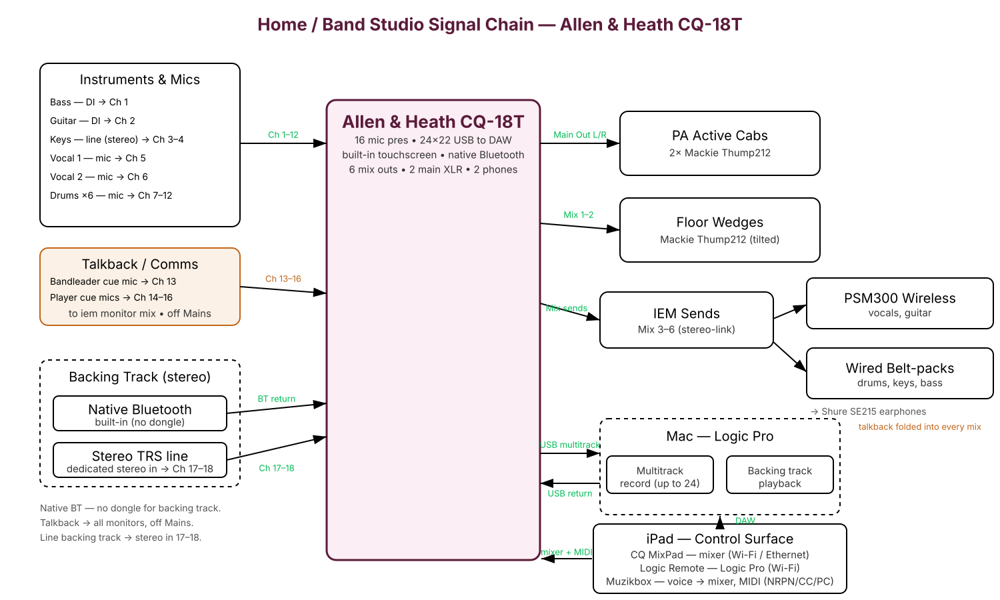

# Home Studio — Allen & Heath CQ-18T

The build the home studio centers on. (Home and band-studio are documented
separately for now; they'll be reconciled once the two rooms settle.) The mixer
selection rationale — DL16SE vs. CQ-18T and the full value-tier gear list — lives
in the [comparison doc](./home-studio-setup-part2-comparison.md).

The CQ-18T wins on the three things that matter for this rig: a **built-in
touchscreen** (so the mixer isn't wholly app-dependent), **native Bluetooth** (no
dongle for the wireless backing track), and an **officially documented MIDI
control protocol** (the clean path for Muzikbox voice automation).

## Control surfaces (iPad-centric)

The CQ-18T's own touchscreen is always available; day-to-day control is on iPad:

| App (iPad) | Controls | Transport |
|---|---|---|
| **CQ MixPad** | the mixer (faders, sends, scenes, gain) | Wi-Fi / Ethernet to the CQ-18T |
| **Logic Remote** | Logic Pro on the Mac (transport, mixer, key commands) | Wi-Fi to the Mac |
| **[Muzikbox](https://github.com/muze-interactive/muzikbox)** | voice → mixer via documented MIDI (NRPN/CC/PC) | MIDI over USB or network |

DAW is **Logic Pro** (Ableton dropped from this build). The CQ-18T is a 24×22 USB
interface into Logic for multitrack record and USB backing-track return.

## Input / channel map

16 mic pres (Ch 1–8 XLR, Ch 9–16 combo XLR/TRS with Hi-Z), a dedicated stereo TRS
line input (Ch 17–18), native Bluetooth, and USB return. That is enough to run a
6-mic drum kit **and** a comms/talkback system at the same time:

| Source | Connector | Channel |
|--------|-----------|---------|
| Bass | DI → line/XLR | 1 |
| Guitar | DI → line/XLR | 2 |
| Keys (stereo) | line | 3–4 |
| Vocal 1 | mic (XLR) | 5 |
| Vocal 2 | mic (XLR) | 6 |
| Drums ×6 | mic | 7–12 |
| Talkback / cue mics (up to 4) | mic | 13–16 |
| Backing track — line | dedicated stereo TRS in | 17–18 |
| Backing track — wireless | native Bluetooth | BT return |
| Backing track — from DAW | USB return | USB |

Two moves make 6 drum mics *and* talkback fit inside 16 mic pres: the **line-level
backing track uses the dedicated stereo input (17–18)** instead of burning two mic
pres, and the **wireless backing track uses native Bluetooth**. (For a bass/guitar
plugged in *directly* at instrument level, use a combo Hi-Z input, Ch 9–16, or keep
them on 1–2 through a DI box as shown.)

## Output routing (main vs. monitors)

Verified against A&H's routing docs — the CQ-18T does exactly the main-vs-monitor
split this rig needs:

- **8 physical outs:** Main L/R (XLR) + **6 aux "Mix" outs** (TRS). Any Mix can feed
  a floor wedge, an IEM pack, or a studio monitor.
- **Per-channel Main assign on/off:** any input can be de-assigned from Main L/R
  entirely, so a talkback/cue mic feeds monitors only and never reaches the PA.
- **Independent per-Mix sends:** every channel has its own send level (pre/post-fade
  selectable) to each of the 6 Mixes — you choose which channels land in which
  monitor mix, so **wedges and IEMs are separate Mixes and don't share content**.
- **Stereo-linkable auxes:** link Mixes in pairs for stereo IEMs — 6 mono up to
  3 stereo IEM mixes.

Rig mapping: **Mix 1–2 → floor wedges**, **Mix 3–6 → IEMs** (stereo-linked as
needed). Talkback rides in the monitor Mixes with its Main assign off.

## Comms / Talkback — communicating cues over IEMs

**The problem:** IEMs seal players off from ambient stage sound, so band mates
can't hear each other call cues ("top of the bridge," a count-in, "watch the
ending") the way they would on open wedges. Comms has to be built into the monitor
path deliberately.

**Impact on the IEM *solution* — none structurally.** Talkback is just another
audio source folded into each monitor mix, so the IEM hardware is unchanged: the
same hybrid of **PSM300 wireless** (movers: 2 vocals, guitar) + **wired belt-packs**
(stationary: drums, keys, bass) still stands. The one rule is that talkback must be
present in **every** monitor bus — both the wireless sends and the wired-belt-pack
sends — or whoever's mix omits it goes deaf to cues.

**Impact on mixer *inputs* — one mic pre per cue mic.** The CQ-18T has **no
dedicated hardware talkback mic/button** (unlike A&H's larger SQ/Avantis consoles),
so talkback is built by dedicating ordinary input channels and routing them only to
the monitor buses:

- The two **vocal mics already double as talkback** — vocals are in everyone's
  monitor mix, so the singers can already talk to the band. The gap is the
  *non-singing* players (drummer, bass, keys, guitar).
- **Minimum viable comms:** one **bandleader cue mic** (usually at the drummer —
  the timekeeper who counts things in) on **Ch 13**. +1 mic pre.
- **Full duplex:** a small dynamic (SM57/58 or gooseneck) per non-singer on
  **Ch 14–16**, so anyone can talk. Up to +4 total across Ch 13–16.
- **Routing per talkback channel:** send it to **all six monitor mixes**, and set
  its send to **Main L/R off** so the count-ins and chatter never hit the PA /
  audience. Put the talkback channels in a **mute group** so one button silences
  all cue mics for the actual performance, and un-mutes them between songs.
- Because each musician can open their own mix in **CQ MixPad**, they can also ride
  the talkback level in their own ears independently.

**Net:** comms costs **1–4 mic pres (Ch 13–16)** and **zero new IEM hardware** —
it's a routing exercise, not a gear purchase. Cost is a handful of cheap dynamic
mics + short stands/clips (~$25–100 each). The channel budget still closes because
the backing-track line and Bluetooth paths stay off the mic pres.
