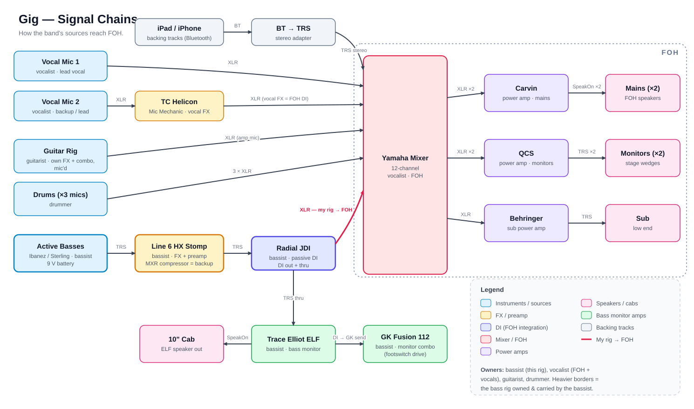
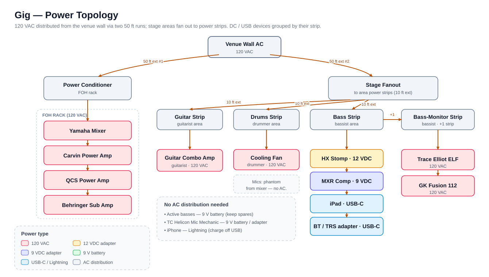

# Band Gig Configuration

This is an **example full-band gig configuration** — a front-of-house (FOH) PA and
stage setup that the bassist plays *into*, rather than one they own or run. Most of
the rig belongs to bandmates: the **vocalist** supplies the FOH (mixer, power amps,
mains, monitors, sub, conditioner) and vocals, the **guitarist** brings their own
guitar rig, and the **drummer** brings the drums. **The bassist's contribution is
the bass signal chain**, which integrates with the PA at FOH through a single,
consistent handoff: the **Radial JDI**'s XLR DI output into the vocalist's mixer.

> Roles are used in place of names throughout, so this can serve as a general
> example. "Mine" / first-person refers to the bassist whose rig is documented.

It captures two views, kept as separate diagrams because a single combined diagram
of ~20 components plus AC/DC power would be too dense to read:

- **[Signal chains](./gig-signal-chains.svg)** — how every source reaches FOH, plus
  my stage-monitor branch.
- **[Power topology](./gig-power-topology.svg)** — how 120 VAC is distributed and
  where DC/USB/battery devices sit.

Both are derived from the gig spreadsheet: the component/cabling worksheet drives
the signal chains and fanout, and the [bill of materials](#bill-of-materials)
worksheet backs it up (quantities, ownership, power supplies).

## Signal Chains

Sources flow left-to-right into the **Yamaha 12-channel mixer**, then out to three
power amps and their speakers:

- **Vocal Mic 1** → XLR → mixer.
- **Vocal Mic 2** → **TC Helicon Mic Mechanic** (vocal FX, chained on Mic 2) → XLR
  → mixer. The Mic Mechanic's output serves as that channel's FOH DI.
- **Guitar Rig (guitarist)** — their own FX + combo, mic'd → XLR → mixer.
- **Drums (drummer)** — three mics → 3× XLR → mixer.
- **Bass (mine)** — Ibanez / Sterling active bass (TRS) → **Line 6 HX Stomp**
  (FX + preamp; **MXR compressor** is the backup) → **Radial JDI** passive DI.
  - **JDI DI out → XLR → mixer.** This is the one integration point between my rig
    and the band's PA (highlighted in red on the diagram).
  - **JDI 1/4" thru → my stage-monitor branch** (below).
- **Backing tracks** — iPad / iPhone stream over Bluetooth → a **BT → TRS stereo
  adapter** → mixer.

**FOH amplification:** the mixer feeds three power amps over XLR, each driving its
own speakers:

- **Carvin** — XLR ×2 in → SpeakOn ×2 → mains (×2).
- **QCS** — XLR ×2 in → TRS ×2 → monitors (×2).
- **Behringer** sub amp — XLR in → TRS → sub.

### My stage-monitor branch

The JDI's thru jack feeds my own monitoring, independent of FOH — the same
daisy-chain used in the [Performance Rig](../../README.md#performance-rig):

- **JDI thru (TRS) → Trace Elliot ELF** → SpeakOn → **10" cab** (my on-stage
  bass monitor).
- **TE ELF DI out → GK send → GK Fusion 112** combo (footswitch selects the drive
  configuration). The GK is also the fallback if I drop the HX Stomp.

## Power Topology

All AC comes from the **venue wall** over two 50 ft runs:

- **Run #1 → Power Conditioner** (in the vocalist's FOH rack), which feeds the
  **Yamaha mixer**, **Carvin**, **QCS**, and **Behringer** amps — all 120 VAC.
- **Run #2 → Stage Fanout**, split by three 10 ft extension cords to per-area
  **power strips** (guitar, drums, bass), plus a fourth strip for the bass monitor
  setup:
  - **Guitar strip** → the guitarist's combo amp (120 VAC).
  - **Drums strip** → the drummer's cooling fan (120 VAC) for extra ventilation. The
    drum mics themselves take phantom power from the mixer, so they need no AC.
  - **Bass strip** → HX Stomp (12 VDC adapter), MXR compressor (9 VDC adapter),
    iPad and the BT/TRS adapter (USB-C).
  - **Bass-monitor strip** → Trace Elliot ELF and GK Fusion 112 (both 120 VAC).

**No AC distribution needed:** the active basses (9 V battery — keep spares), the
TC Helicon Mic Mechanic (9 V battery or adapter), and the iPhone (Lightning,
charged off USB).

## Ownership

| Owner | Supplies |
|-------|----------|
| **Bassist (me)** | Bass signal chain — basses, HX Stomp, MXR, Radial JDI, TE ELF + 10" cab, GK Fusion 112, iPad |
| **Vocalist / FOH** | FOH — Yamaha mixer, Carvin / QCS / Behringer amps, mains / monitors / sub, power conditioner, vocal mics + stands, TC Helicon, iPhone, BT/TRS adapter |
| **Guitarist** | Guitar rig (own FX + combo) |
| **Drummer** | Drum kit and drum mics |

## Bill of Materials

Backed by the BOM worksheet in the gig spreadsheet. Ownership columns indicate who
brings each item.

### The most important components...

For outdoor summer venue:

| Item | Qty | Owner | Notes |
|------|-----|-------|-------|
| Fan | 1 | Drummer | |
| Tents | 2 | Venue Owner | |

Gotta keep the drummer cool, and the band dry.

### Instruments

| Item | Qty | Owner | Notes |
|------|-----|-------|-------|
| Drum Kit | 1 | Drummer | |
| Guitar | 1 | Guitarist | |
| Ibanez SR500/2600 | 2 | Vocalist / Bassist | Vocalist's primary; bassist's primary 4-string. Keep 9 VDC on hand |
| Ibanez SRMS725 | 1 | Bassist | Primary 5-string. Keep 9 VDC on hand |
| Sterling RAY35 H | 1 | Bassist | Backup 5-string. 9 VDC on hand |
| Hercules Stand | 1 | Bassist | Holds up to 3 basses |

### Mics & Stands

| Item | Qty | Owner |
|------|-----|-------|
| Voice Mics | 2 | Vocalist |
| Guitar Amp Mic | 1 | Vocalist |
| Drum Mics | 3 | Drummer |
| Voice Mic Stands | 2 | Vocalist |
| Guitar Mic Stand | 1 | Vocalist |
| Drum Mic Stands | 3 | Drummer |

### FX

| Item | Qty | Power | Owner | Notes |
|------|-----|-------|-------|-------|
| HX Stomp | 1 | 12 VDC adapter | Bassist | Primary bass FX rig |
| MXR Compressor | 1 | 9 VDC adapter | Bassist | Backup bass FX rig |
| TC Helicon Mic Mechanic | 1 | 9 V battery / adapter | Vocalist | Vocal FX |
| Radial JDI Passive | 1 | — | Bassist | Bass-rig FOH DI |
| Guitar FX | — | — | Guitarist | Guitarist covers, independent of FOH |

### Monitoring (bass, mine)

| Item | Qty | Owner |
|------|-----|-------|
| Trace Elliot ELF | 1 | Bassist |
| 10" Cab Monitor | 1 | Bassist |
| GK Fusion 112 Combo | 1 | Bassist |
| GK Drive Footswitch | 1 | Bassist |

### FOH (vocalist)

| Item | Qty | Notes |
|------|-----|-------|
| iPad | 1 | Backing tracks (USB-C) — actually the bassist's; iPhone is the vocalist's |
| iPad Stand | 1 | |
| iPhone | 1 | Lightning |
| Bluetooth / TRS Stereo Adapter | 1 | |
| Yamaha 12-Channel Mixer | 1 | |
| Carvin Power Amp | 1 | |
| QCS Power Amp | 1 | |
| Behringer Subs Power Amp | 1 | |
| Power Conditioner | 1 | |
| Monitor Cabs | 2 | |
| Mains Cabs | 2 | |
| Sub Cab | 1 | |

### Cables & Power

| Item | Qty | Owner | Purpose |
|------|-----|-------|---------|
| NEMA 5-15P → IEC-320-C13, 120 VAC | 7 | Bassist (2: GK+TE) / vocalist (5) | 3 FOH amps, mixer, 2 bass monitor amps |
| 120 VAC extension cord, 50 ft | 2 | Vocalist | 1 for power conditioner, 1 for everything else |
| 120 VAC extension cord, 10 ft | 3 | Bassist (1) / vocalist (2) | Fanout to guitar, drums, bass areas |
| Power Strips | 4 | Bassist (1) / vocalist (3) | One per fanout + 1 for bass monitor setup |
| SpeakOn cable, 25 ft | 2 | Vocalist | Mains |
| TRS speaker cable, 25 ft | 3 | Vocalist | Monitors, sub |
| TRS unbalanced, 25 ft | 2 | Bassist (1) / guitarist (1) | Bass / guitar signal chain |
| XLR male→female, 25 ft | 7 | Bassist (1) / vocalist (6) | Vocal, drums, guitar mics, bass DI |
| TRS → XLR (female), 25 ft | 1 | Vocalist | Vocal FX (TRS) to mixer |
| XLR (male) → TRS, 6 ft | 1 | Bassist | TE ELF DI to GK send |

> **Source:** the gig spreadsheet (component/cabling and BOM worksheets). Connector
> types, quantities, and amp→speaker assignments are taken from the cabling columns.
