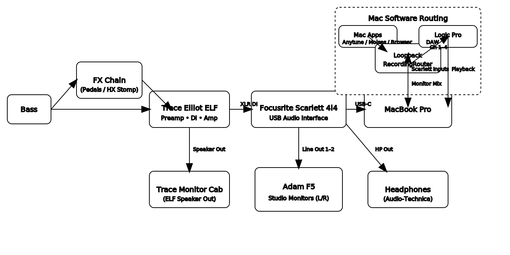
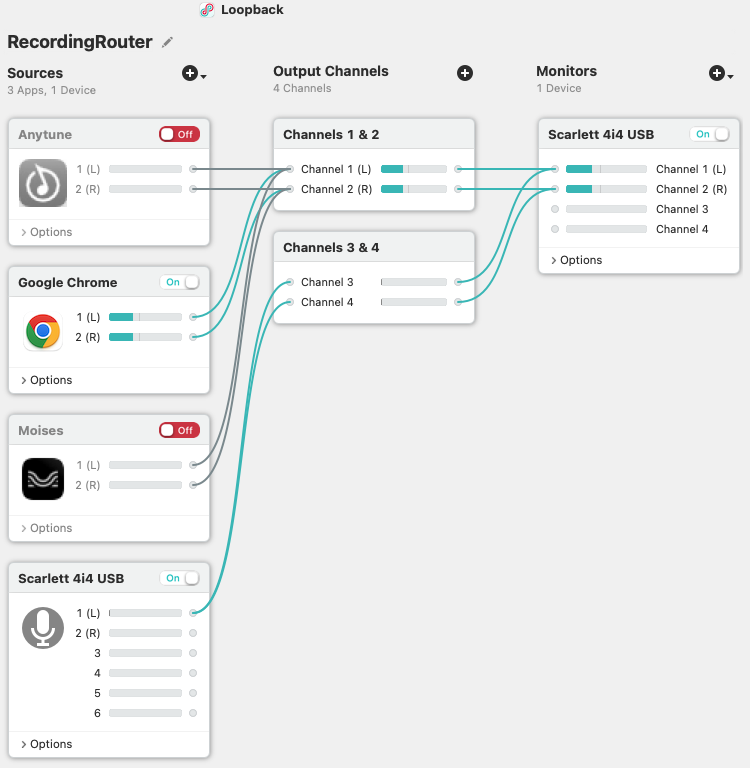

# Home Music Studio Rig Documentation

## Overview

This document describes a comprehensive home music studio setup designed for bass guitar practice, recording, and live streaming. The rig provides flexible signal routing through both analog and digital components, enabling various workflows from simple practice to complex recording sessions.

## Signal Flow Architecture

### General Signal Flow
1. **Instrument Source** → FX Chain or Preamp/Combo/DI device
2. **FX Chain** (pedalboard) → Preamp/Combo/DI device
3. **Preamp/Combo/DI** → Analog to Digital interface (primary) + optional monitor cab
4. **DI Output** → Analog to Digital interface via TS/XLR
5. **A/D Interface** → Host device (laptop/tablet) for digital routing
6. **Virtual Router** → Creates virtual devices for:
   - Audio input from applications (backing tracks, live content)
   - Software representation of A/D interface channels
   - Input channel mixing capabilities
   - Monitor routing to D/A interface channels
7. **DAW Configuration**:
   - Virtual router as input device
   - D/A interface as output device
   - Instrument track (sources virtual router channels)
   - Backing track (sources virtual router channels)
   - Recording, playback, and export capabilities

## Current Configuration

### Hardware Components
- **Instrument**: Active/Passive bass guitar
- **FX Chain**: Pedalboard with analog pedals OR HX Stomp (mono, left channel)
- **Preamp/Combo/DI**: Trace Elliot ELF
- **A/D Interface**: Focusrite Scarlett 4i4 Gen 3
- **Host Machine**: MacBook Pro
- **Virtual Router**: Loopback software ("RecordingRouter" device)
- **DAW**: Logic Pro
- **Monitoring**:
  - Adam 5 studio monitors (stereo, channels 1-2)
  - Audio Technica headphones
  - Trace Elliot monitor cab (driven by ELF's 200W amp)

### Software Configuration

#### Loopback Virtual Router Setup
- **Device Name**: "RecordingRouter"
- **Input Sources**:
  - Anytune app
  - MoisesAI app
  - Chrome Browser
  - Scarlett input channel 1 (split to channels 3 & 4 for stereo simulation)
- **Output Configuration**:
  - Channels 1-2: Mixed digital sources
  - Channels 3-4: Instrument signal (stereo split)
- **Monitor Output**: Scarlett channels 1-2 (aggregates channels 1&3, 2&4)

#### Logic Pro Configuration
- **Input Device**: RecordingRouter
- **Output Device**: Scarlett
- **Tracks**:
  - Bass input track: sources RecordingRouter channel 3
  - Backing track: sources RecordingRouter channel 1

## Diagram

### Overview

### Software router configuration

## Workflows

### 1. Practice/Improv (Analog Only)
- **Signal Path**: Bass → FX Chain → Trace Elliot ELF → Monitor Cab
- **Use Case**: Simple practice without digital components
- **Benefits**: Zero latency, immediate response

### 2. Practice/Improv with Backing Tracks
- **Signal Path**: Full digital routing through virtual router
- **Use Case**: Practice with backing tracks or live streaming content
- **Features**:
  - Mixed instrument and backing track audio
  - Conferencing software integration (Zoom, etc.)
  - No DAW required

### 3. Recording Session
- **Signal Path**: Complete flow through DAW
- **Use Case**: Professional recording with monitoring
- **Features**:
  - Low-latency monitoring via Loopback
  - Multi-track recording capability
  - Post-production editing and mixing
  - Export to various audio/video formats

## Bill of Materials

### Hardware
| Component | Model | Purpose | Connection Type |
|-----------|-------|---------|-----------------|
| Bass Guitar | Active/Passive | Primary instrument | TS instrument cable |
| FX Chain | Pedalboard OR HX Stomp | Effects processing | TS instrument cable |
| Preamp/Combo | Trace Elliot ELF | Amplification & DI | XLR to interface |
| Audio Interface | Focusrite Scarlett 4i4 Gen 3 | A/D & D/A conversion | USB-C to host |
| Studio Monitors | Adam 5 (pair) | Main monitoring | XLR→TS speaker cables |
| Headphones | Audio Technica | Private monitoring | 1/4" TRS |
| Monitor Cabinet | Trace Elliot | Amplified monitoring | TS speaker cable |
| Host Computer | MacBook Pro | Digital processing | USB-C |

### Software
| Component | Purpose | Configuration |
|-----------|---------|---------------|
| Loopback | Virtual audio routing | RecordingRouter device |
| Logic Pro | Digital Audio Workstation | Multi-track recording |
| Anytune | Backing track playback | Virtual router input |
| MoisesAI | AI-powered backing tracks | Virtual router input |
| Chrome Browser | Web-based content | Virtual router input |

### Cables & Adapters
| Type | Quantity | Purpose |
|------|----------|---------|
| TS Instrument Cable | 2 | Bass to FX chain, FX to preamp |
| XLR Cable | 1 | Preamp DI to interface |
| USB-C Cable | 1 | Interface to host |
| XLR→TS Speaker Cables | 2 | Interface to studio monitors |
| TS Speaker Cable | 1 | ELF to monitor cab |
| 1/4" TRS Cable | 1 | Interface to headphones |

## Technical Specifications

### Audio Interface (Focusrite Scarlett 4i4 Gen 3)
- **Inputs**: 4 (2 mic/line, 2 instrument)
- **Outputs**: 4 (2 main, 2 headphone)
- **Sample Rate**: Up to 192kHz
- **Bit Depth**: 24-bit
- **Latency**: <3ms round trip

### Preamp (Trace Elliot ELF)
- **Power**: 200W
- **Inputs**: 1 instrument
- **Outputs**: DI (XLR), speaker out
- **Features**: Built-in EQ, compression

### Virtual Router (Loopback)
- **Channels**: 4 input, 4 output
- **Latency**: <1ms
- **Features**: Real-time mixing, monitoring

## Setup Notes

1. **Latency Management**: Loopback monitor configuration reduces perceived latency during recording
2. **Stereo Simulation**: Instrument signal split to channels 3-4 for stereo width
3. **Flexible Routing**: Virtual router allows quick switching between workflows
4. **Monitoring Options**: Multiple monitoring paths for different use cases
5. **Scalability**: System can be expanded with additional virtual router channels or hardware components

## Maintenance & Troubleshooting

### Common Issues
- **Latency**: Check Loopback buffer settings
- **Audio Dropouts**: Verify USB connection and host performance
- **Ground Noise**: Check cable routing and power supply isolation
- **Driver Issues**: Keep Focusrite drivers updated

### Performance Optimization
- Close unnecessary applications during recording
- Use SSD storage for audio files
- Monitor CPU usage during complex sessions
- Regular software updates for all components