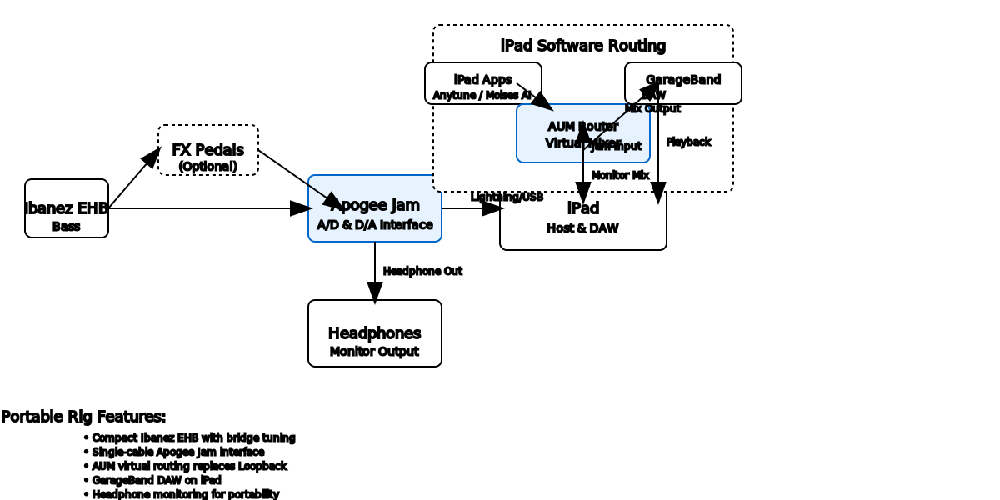

# Portable Music Studio Rig Documentation

## Overview

This document describes a compact, portable music studio setup designed for bass guitar practice, recording, and live streaming using iPad-based components. The rig provides flexible signal routing through AUM (Audio Unit Mixer) as the virtual router, enabling various workflows from simple practice to complex recording sessions in a highly portable format.

## Signal Flow Architecture

### General Signal Flow
1. **Instrument Source** → FX Chain (optional) → Apogee Jam
2. **Apogee Jam** → iPad via Lightning/USB connection
3. **iPad Apps** (Anytune, Moises AI) → AUM Router
4. **AUM Router** → Creates virtual mixing environment for:
   - Audio input from applications (backing tracks, live content)
   - Software representation of Apogee Jam input channel
   - Input channel mixing capabilities
   - Monitor routing to Apogee Jam headphone output
5. **GarageBand Configuration**:
   - AUM Router as input source
   - Apogee Jam as output device
   - Instrument track (sources AUM mixed output)
   - Backing track (sources AUM mixed output)
   - Recording, playback, and export capabilities

## Current Configuration

### Hardware Components
- **Instrument**: Ibanez EHB bass (compact size, bridge tuning)
- **FX Chain**: Optional pedalboard with analog pedals
- **A/D & D/A Interface**: Apogee Jam
- **Host Machine**: iPad
- **Virtual Router**: AUM (Audio Unit Mixer)
- **DAW**: GarageBand
- **Monitoring**: Headphones via Apogee Jam headphone output

### Software Configuration

#### AUM Virtual Router Setup
- **Device Name**: "PortableRouter" (custom session name)
- **Input Sources**:
  - Anytune app (backing track playback)
  - MoisesAI app (AI-powered backing tracks)
  - Apogee Jam input channel (instrument signal)
- **Output Configuration**:
  - Channel 1: Mixed digital sources (backing tracks)
  - Channel 2: Instrument signal (direct from Jam)
  - Master Output: Mixed signal to GarageBand
- **Monitor Output**: Apogee Jam headphone output (low-latency monitoring)

#### GarageBand Configuration
- **Input Device**: AUM Router output
- **Output Device**: Apogee Jam
- **Tracks**:
  - Bass input track: sources AUM mixed output
  - Backing track: sources AUM backing track channel

## Diagram

## AUM Configuration Guide

### Step 1: Create New AUM Session
1. Open AUM app on iPad
2. Tap "+" to create new session
3. Name it "PortableRouter" or your preferred name
4. Set sample rate to 44.1kHz or 48kHz (match your DAW)

### Step 2: Configure Input Sources

#### Add Apogee Jam Input
1. Tap "+" in the Inputs section
2. Select "Audio Input"
3. Choose "Apogee Jam" from the list
4. Configure:
   - **Gain**: Set to appropriate level for your bass
   - **Pan**: Center (0)
   - **Mute**: Off
   - **Solo**: Off

#### Add App Audio Sources
1. Tap "+" in the Inputs section
2. Select "App Audio"
3. Add each app:
   - **Anytune**: For backing track playback
   - **MoisesAI**: For AI-generated backing tracks
4. Configure each app input:
   - **Gain**: Set to -6dB to -12dB (leave headroom)
   - **Pan**: Center (0)
   - **Mute**: Off initially

### Step 3: Configure Mixer Channels

#### Create Mixer Groups
1. **Backing Tracks Group**:
   - Add mixer channel
   - Route Anytune and MoisesAI inputs to this group
   - Set group fader to -6dB
   - Name: "Backing Tracks"

2. **Instrument Group**:
   - Add mixer channel
   - Route Apogee Jam input to this group
   - Set group fader to 0dB
   - Name: "Bass"

#### Master Mixer
1. Route both groups to Master
2. Set Master fader to 0dB
3. Enable Master output to Apogee Jam

### Step 4: Configure Output Routing

#### Main Output
1. Tap "+" in Outputs section
2. Select "Audio Output"
3. Choose "Apogee Jam"
4. Route Master mixer to this output
5. This becomes your DAW input source

#### Monitor Output
1. The same Apogee Jam output serves as monitor
2. Headphones connected to Jam provide low-latency monitoring
3. No additional configuration needed

### Step 5: Save and Test
1. Save the AUM session
2. Test signal flow:
   - Play bass → should hear in headphones
   - Play backing track in Anytune → should hear in headphones
   - Both should be mixed together

## GarageBand Configuration

### Step 1: Audio Settings
1. Open GarageBand
2. Go to Settings → Audio
3. Set **Input Device**: AUM Router (or your session name)
4. Set **Output Device**: Apogee Jam
5. Set **Buffer Size**: 64 or 128 samples (for low latency)

### Step 2: Create Project
1. Create new project
2. Choose "Empty Project"
3. Add tracks as needed

### Step 3: Configure Tracks
1. **Bass Track**:
   - Input: AUM Router (mixed output)
   - Output: Master
   - Record enabled
   - Monitor: On

2. **Backing Track Track** (optional):
   - Input: AUM Router (mixed output)
   - Output: Master
   - Record enabled
   - Monitor: On

## Workflows

### 1. Practice/Improv (Analog Only)
- **Signal Path**: Bass → Apogee Jam → Headphones
- **Use Case**: Simple practice without digital components
- **Benefits**: Zero latency, immediate response
- **Setup**: Bypass AUM, use Jam directly

### 2. Practice/Improv with Backing Tracks
- **Signal Path**: Full digital routing through AUM
- **Use Case**: Practice with backing tracks or live streaming content
- **Features**:
  - Mixed instrument and backing track audio
  - Conferencing software integration (Zoom, etc.)
  - No DAW required
- **Setup**: Use AUM session, no GarageBand needed

### 3. Recording Session
- **Signal Path**: Complete flow through DAW
- **Use Case**: Professional recording with monitoring
- **Features**:
  - Low-latency monitoring via AUM
  - Multi-track recording capability
  - Post-production editing and mixing
  - Export to various audio/video formats
- **Setup**: AUM + GarageBand

## Bill of Materials

### Hardware
| Component | Model | Purpose | Connection Type |
|-----------|-------|---------|-----------------|
| Bass Guitar | Ibanez EHB | Primary instrument | TS instrument cable |
| FX Chain | Optional pedals | Effects processing | TS instrument cable |
| Audio Interface | Apogee Jam | A/D & D/A conversion | Lightning/USB to iPad |
| Host Computer | iPad | Digital processing | Lightning/USB |
| Headphones | Any quality pair | Monitoring | 1/8" TRS |

### Software
| Component | Purpose | Configuration |
|-----------|---------|---------------|
| AUM | Virtual audio routing | PortableRouter session |
| GarageBand | Digital Audio Workstation | Multi-track recording |
| Anytune | Backing track playback | AUM app audio input |
| MoisesAI | AI-powered backing tracks | AUM app audio input |

### Cables & Adapters
| Type | Quantity | Purpose |
|------|----------|---------|
| TS Instrument Cable | 1 | Bass to Jam (or to FX chain) |
| Lightning/USB Cable | 1 | Jam to iPad |
| 1/8" TRS Cable | 1 | Jam to headphones |

## Technical Specifications

### Audio Interface (Apogee Jam)
- **Inputs**: 1 instrument
- **Outputs**: 1 headphone
- **Sample Rate**: Up to 96kHz
- **Bit Depth**: 24-bit
- **Latency**: <3ms round trip
- **Power**: USB bus powered

### Virtual Router (AUM)
- **Channels**: Unlimited input/output
- **Latency**: <1ms
- **Features**: Real-time mixing, monitoring, AU hosting

### Host (iPad)
- **Requirements**: iOS 13.0 or later
- **Storage**: 64GB minimum (128GB recommended)
- **Processing**: A12 Bionic or later recommended

## Setup Notes

1. **Latency Management**: AUM monitor configuration reduces perceived latency during recording
2. **Portability**: Single-cable setup with Jam interface
3. **Flexible Routing**: AUM allows quick switching between workflows
4. **Monitoring Options**: Headphone monitoring for portability
5. **Scalability**: System can be expanded with additional AUM channels or AU plugins

## AUM Session Template

### Recommended Channel Strip Settings
- **Input Gain**: -6dB to -12dB (leave headroom)
- **EQ**: High-pass filter at 80Hz for backing tracks
- **Compression**: Light compression on bass channel (2:1 ratio)
- **Reverb**: Optional room reverb on master (10% wet)

### Monitoring Setup
- **Headphone Level**: -6dB to prevent clipping
- **Mix Balance**: 70% bass, 30% backing tracks
- **Solo Functions**: Enable for individual channel monitoring

## Maintenance & Troubleshooting

### Common Issues
- **Latency**: Check AUM buffer settings and iPad performance
- **Audio Dropouts**: Close unnecessary apps, check iPad storage
- **Ground Noise**: Use quality instrument cable, check power supply
- **Driver Issues**: Keep iOS updated, restart iPad if needed

### Performance Optimization
- Close unnecessary apps during recording
- Use SSD storage for audio files
- Monitor iPad battery during long sessions
- Regular iOS updates for all components
- Restart iPad before important sessions

### AUM-Specific Tips
- Save multiple session templates for different workflows
- Use AU plugins sparingly to maintain performance
- Enable "Background Audio" in iOS settings
- Use "Do Not Disturb" mode during recording
- Monitor CPU usage in AUM's performance meter

## Comparison with Home Rig

| Feature | Home Rig | Portable Rig |
|---------|----------|--------------|
| Interface | Focusrite Scarlett 4i4 | Apogee Jam |
| Virtual Router | Loopback | AUM |
| DAW | Logic Pro | GarageBand |
| Monitoring | Studio monitors + headphones | Headphones only |
| Portability | Fixed location | Highly portable |
| Channel Count | 4 inputs, 4 outputs | 1 input, 1 output |
| Power | AC powered | USB bus powered |
| Setup Time | 5-10 minutes | 1-2 minutes |

## Future Expansion Options

1. **Additional Interfaces**: Daisy-chain multiple Apogee devices
2. **AU Plugins**: Add effects and processing in AUM
3. **External Controllers**: MIDI controllers for hands-free operation
4. **Wireless Monitoring**: Bluetooth headphones (with latency consideration)
5. **Cloud Integration**: iCloud backup of sessions and recordings