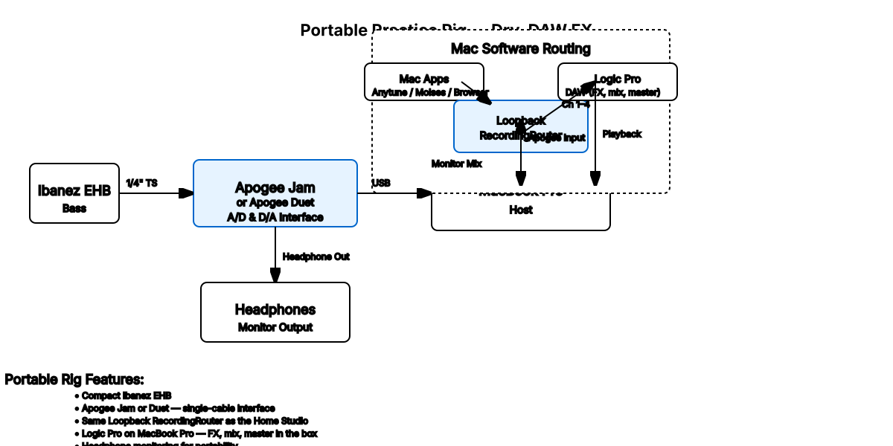

# Portable Practice Rig Documentation

## Overview

This document describes a compact, portable music studio setup designed for bass guitar practice, recording, and live streaming on a MacBook Pro. It mirrors the Home Studio Recording Configuration — Loopback for routing, Logic Pro as DAW, FX handled in the box — with a more portable A/D interface (Apogee Jam or Duet) and headphones-only monitoring.

## Signal Flow Architecture

### General Signal Flow
1. **Instrument Source** → Apogee Jam or Apogee Duet (instrument input, dry)
2. **Apogee** → MacBook Pro via USB
3. **Mac Apps** (Anytune, Moises AI, Browser) → Loopback Router
4. **Loopback Router** → Creates virtual mixing environment for:
   - Audio input from applications (backing tracks, live content)
   - Software representation of Apogee input channel
   - Input channel mixing capabilities
   - Monitor routing back to the Apogee headphone output
5. **Logic Pro Configuration**:
   - Loopback Router as input source
   - Apogee as output device
   - Instrument track sources Loopback channel for bass
   - Backing track sources Loopback channel for apps
   - FX, amp/IR simulation, mixing, and mastering all happen in Logic Pro

## Current Configuration

### Hardware Components
- **Instrument**: Ibanez EHB bass (compact, travel-friendly)
- **A/D & D/A Interface**: Apogee Jam *or* Apogee Duet
- **Host Machine**: MacBook Pro
- **Virtual Router**: Loopback ("RecordingRouter" device, shared with Home Studio)
- **DAW**: Logic Pro
- **Monitoring**: Headphones via Apogee headphone output

### Software Configuration

Same Loopback `RecordingRouter` device and Logic Pro setup as the Home Studio Recording Configuration. The Apogee replaces the Focusrite Scarlett 4i4 as the input device; everything downstream is identical.

#### Loopback Virtual Router Setup
- **Device Name**: "RecordingRouter"
- **Input Sources**:
  - Anytune app
  - MoisesAI app
  - Chrome Browser
  - Apogee input channel
- **Output Configuration**:
  - Channels 1-2: Mixed digital sources (backing tracks, app audio)
  - Channels 3-4: Instrument signal
- **Monitor Output**: Apogee headphone output

#### Logic Pro Configuration
- **Input Device**: RecordingRouter
- **Output Device**: Apogee Jam or Duet
- **Tracks**:
  - Bass input track: sources RecordingRouter instrument channel, FX/amp sims applied in-box
  - Backing track: sources RecordingRouter app audio channel

## Diagram

## Workflows

### 1. Practice/Improv (Dry, In-the-Box)
- **Signal Path**: Bass → Apogee → Loopback → headphones
- **Use Case**: Quick practice with no backing tracks
- **Benefits**: Single-cable interface, immediate response, FX optional in Logic

### 2. Practice with Backing Tracks
- **Signal Path**: Full digital routing through Loopback
- **Use Case**: Practice with backing tracks or live streaming content
- **Features**:
  - Mixed instrument and backing track audio in headphones
  - Conferencing software integration (Zoom, etc.)
  - No DAW required for monitoring-only use

### 3. Recording Session
- **Signal Path**: Complete flow through Logic Pro
- **Use Case**: Dry capture for later mixing/mastering
- **Features**:
  - Low-latency monitoring via Loopback
  - Multi-track recording capability
  - FX, amp/IR simulation, mix, and master in Logic Pro
  - Export to various audio/video formats

## Bill of Materials

### Hardware
| Component | Model | Purpose | Connection Type |
|-----------|-------|---------|-----------------|
| Bass Guitar | Ibanez EHB | Primary instrument | TS instrument cable |
| Audio Interface | Apogee Jam *or* Apogee Duet | A/D & D/A conversion | USB to MacBook |
| Host Computer | MacBook Pro | Digital processing | USB |
| Headphones | Audio-Technica (or similar) | Monitoring | 1/4" TRS (Duet) or 1/8" TRS (Jam) |

### Software
| Component | Purpose | Configuration |
|-----------|---------|---------------|
| Loopback | Virtual audio routing | RecordingRouter device (shared with Home Studio) |
| Logic Pro | Digital Audio Workstation | Multi-track recording, FX, mix, master |
| Anytune | Backing track playback | Loopback app audio input |
| MoisesAI | AI-powered backing tracks | Loopback app audio input |
| Chrome Browser | Web-based content | Loopback app audio input |

### Cables & Adapters
| Type | Quantity | Purpose |
|------|----------|---------|
| TS Instrument Cable | 1 | Bass to Apogee |
| USB Cable | 1 | Apogee to MacBook |
| Headphone Cable | 1 | Apogee headphone out to headphones |

## Technical Specifications

### Audio Interface — Apogee Jam
- **Inputs**: 1 instrument
- **Outputs**: 1 headphone
- **Sample Rate**: Up to 96kHz
- **Bit Depth**: 24-bit
- **Power**: USB bus powered

### Audio Interface — Apogee Duet
- **Inputs**: 2 (mic/instrument)
- **Outputs**: 2 line + headphone
- **Sample Rate**: Up to 192kHz
- **Bit Depth**: 24-bit
- **Power**: USB bus powered

### Virtual Router (Loopback)
- **Channels**: 4 input, 4 output
- **Latency**: <1ms
- **Features**: Real-time mixing, monitoring

## Comparison with Home Studio Rig

| Feature | Home Studio | Portable |
|---------|-------------|----------|
| Interface | Focusrite Scarlett 4i4 | Apogee Jam or Duet |
| Virtual Router | Loopback (RecordingRouter) | Loopback (RecordingRouter) |
| DAW | Logic Pro | Logic Pro |
| Monitoring | Adam F5 monitors + headphones | Headphones only |
| FX | Practice Rig uses analog chain; Recording Configuration is dry | Dry, in-the-box only |
| Portability | Fixed location | Highly portable |
| Setup Time | 5-10 minutes | 1-2 minutes |

## Setup Notes

1. **Shared Loopback Device**: Reuse the same `RecordingRouter` Loopback device as the Home Studio so sessions transfer cleanly
2. **Dry Capture**: All FX, amp/IR simulation, and tone shaping live in Logic Pro
3. **Single-Cable Interface**: Apogee Jam keeps the kit small; Duet adds I/O when needed
4. **Headphone Monitoring**: Only output path while traveling

## Maintenance & Troubleshooting

### Common Issues
- **Latency**: Check Loopback buffer settings
- **Audio Dropouts**: Verify USB connection and host performance
- **Driver Issues**: Keep Apogee drivers updated
- **Ground Noise**: Check cable routing and power supply isolation

### Performance Optimization
- Close unnecessary applications during recording
- Use SSD storage for audio files
- Monitor CPU usage during complex sessions
- Regular software updates for all components
